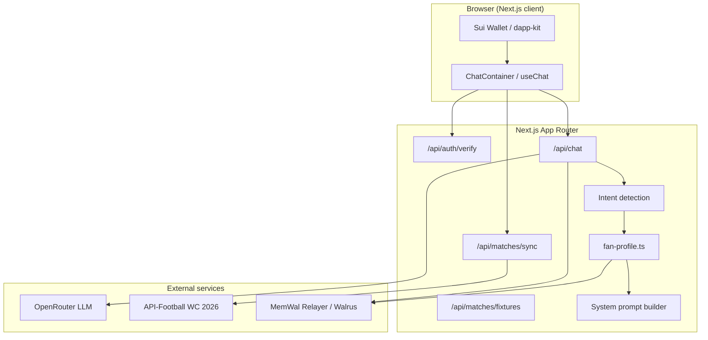

# Mr. Toxic Special One

**One-liner:** A World Cup 2026 roast-bot that remembers every bad take you make — per Sui wallet — and turns it into escalating comedy via Walrus Memory.

**Hackathon track:** [Walrus Sessions 4 — Walrus Memory World Cup](https://thewalrussessions.wal.app/memory-world-cup) (June 5–24, 2026)

---

## Problem & Solution

Football fans talk big before the World Cup: bold predictions, team flip-flops, and selective amnesia when results land. Nobody keeps the receipts — so the banter stays generic.

**Mr. Toxic Special One** fixes that with **Walrus Memory (MemWal)**. Connect your Sui wallet, declare your team, drop predictions, report results — and the bot roasts you with *your own history*. Wrong calls and bandwagon switches crank up a **Toxicity Meter** (1–10). It's American roast comedy energy: sharp, funny, personal — never mean for the sake of it.

---

## Key Features

| Feature | What it does |
|---------|----------------|
| **Memory-driven roast** | Recalls team, predictions, flip-flops, and past burns from Walrus per wallet |
| **Wallet identity** | Sui connect + signed message — no signup, one address = one memory namespace |
| **Prediction tracking** | Saves pending calls; resolves via API-Football sync or manual score entry |
| **Toxicity escalation** | Wrong predictions + flip-flops + high-confidence misses → hotter roasts |
| **Streaming chat** | OpenRouter LLM with model picker; meme-stamp format every reply |
| **Press-room UI** | Dark/gold theme, toxicity meter, prediction sidebar, MemWal live banner |

---

## Architecture

**Chat flow:** verify wallet → sync pending fixtures → detect intent → mutate fan profile → recall memories → build prompt → stream roast → persist to Walrus.

---

## Tech Stack

| Layer | Technology |
|-------|------------|
| Framework | Next.js 14 (App Router) |
| UI | React 18, Tailwind CSS, `@mysten/dapp-kit` |
| LLM | Vercel AI SDK + OpenRouter (user-selectable models) |
| Memory | `@mysten-incubation/memwal` — namespace `special-one-{wallet}` |
| Identity | Sui wallet + `PersonalMessage` signature verification |
| Football data | API-Football (league 1, season 2026) + manual result parsing |
| Validation | Zod schemas for intent + profile shapes |

---

## Memory Fields

Stored per wallet in Walrus (`special-one-{address.toLowerCase()}`):

| Field | Type | Purpose |
|-------|------|---------|
| `favorite_team` | `string` | Current supported team |
| `past_predictions` | `Prediction[]` | Up to 50 match predictions (pending or resolved) |
| `flip_flop_count` | `number` | Times the user switched `favorite_team` |
| `confidence_level` | `"high" \| "medium" \| "low"` | Last declared confidence — fuels escalation |
| `roast_history` | `string[]` | Last 20 assistant roasts (for variety) |
| `last_roast_topics` | `string[]` | Last 5 topics to avoid repetitive angles |

**Prediction object:** `match`, `prediction`, `result`, optional `fixtureId`, `createdAt`.

**Toxicity formula:** `clamp(1, 10, 1 + wrongCount×1.5 + flip_flop_count×2 + highConfidenceWrong×2)`

---

## Personality

**Mr. Toxic Special One** is a *fictional* character — American roast-show energy, not a cold press-conference monologue.

- **Tone:** Confident, theatrical, callback-heavy — like a roast host who actually did their homework on your terrible takes.
- **Format:** Every reply opens hot, drops a `[Meme Format]` beat, builds the roast, lands a closing sting tied to memory.
- **Rules:** English only; witty toxicity, no heavy profanity; roasts fandom and predictions, not real people; never fabricates scores.
- **Escalation:** Early roasts are smug; after wrong predictions and jersey swaps, the bot goes full "I remember everything" mode.

Think Comedy Central Roast meets World Cup group-chat chaos — fun, not hostile.

---

## Demo Script (~3 minutes)

**Prep:** Set `OPENROUTER_API_KEY` + `MEMWAL_*`; connect a Sui wallet. `API_FOOTBALL_KEY` optional.

| Time | Action | Show judges |
|------|--------|-------------|
| 0:00 | Open `/` | Landing + "Enter Press Room" |
| 0:20 | Connect wallet + sign | Verified identity in header |
| 0:30 | Point at MemWal badge | 🟢 LIVE = memories persist to Walrus |
| 0:45 | *"I support Brazil, high confidence"* | Roast names Brazil; team saved |
| 1:15 | *"I predict Brazil 3-0 Argentina in the final"* | Prediction card updates |
| 1:45 | *"Argentina beat Brazil 1-0"* | Wrong call → toxicity meter rises; savage callback |
| 2:15 | *"Actually I support Argentina now"* | Flip-flop roast; tone escalates |
| 2:30 | Refresh page, same wallet | Memory recalled — still knows the graveyard |
| 2:45 | (Optional) Sync matches | API-Football resolves fixture if available |
| 3:00 | Closing | *"Every roast reads and writes Walrus Memory per wallet — the Special One remembers."* |

---

## Status

### Done

- Next.js 14 app with routes: `/` (landing), `/chat` (press room), API routes (`/api/chat`, `/api/auth/verify`, `/api/matches/*`)
- MemWal client + per-wallet namespace + fan profile CRUD
- Intent detection (LLM + regex fallback), toxicity scoring, system prompt contract
- Streaming chat API, wallet auth, API-Football + manual result resolution
- Press-room UI: toxicity meter, prediction card, model selector, meme stamps
- `.env.example`, `docs/SPEC.md`, `pnpm build` / `npm run build` passes

### Optional polish

- Production deploy URL (Vercel) for hackathon submission
- Pre-tournament fixture mocks if API-Football data is sparse
- Redis-backed auth sessions (current: in-memory 24h TTL — fine for demo)
- Single-page vs `/chat` route consolidation

---

## Links

| Resource | Description |
|----------|-------------|
| [GitHub Repository](https://github.com/Olympusxvn/special-one-agent) | Source code and issues |
| [docs/SPEC.md](./docs/SPEC.md) | Full product spec — source of truth |
| [docs/superpowers/specs/2026-06-06-mr-toxic-special-one-design.md](./docs/superpowers/specs/2026-06-06-mr-toxic-special-one-design.md) | Implementation design snapshot |
| [README.md](./README.md) | Developer setup and quick start |

---

## Tóm tắt (VI)

**Mr. Toxic Special One** là chatbot roast kiểu American comedy cho fan bóng đá World Cup 2026 — vui, cá nhân hóa, không thô tục. Mỗi ví Sui có bộ nhớ Walrus riêng (`special-one-{address}`): đội yêu thích, dự đoán, lịch sử roast; độ toxic tăng khi dự đoán sai hoặc đổi đội. Stack: Next.js 14, MemWal, Sui wallet, OpenRouter, API-Football.
